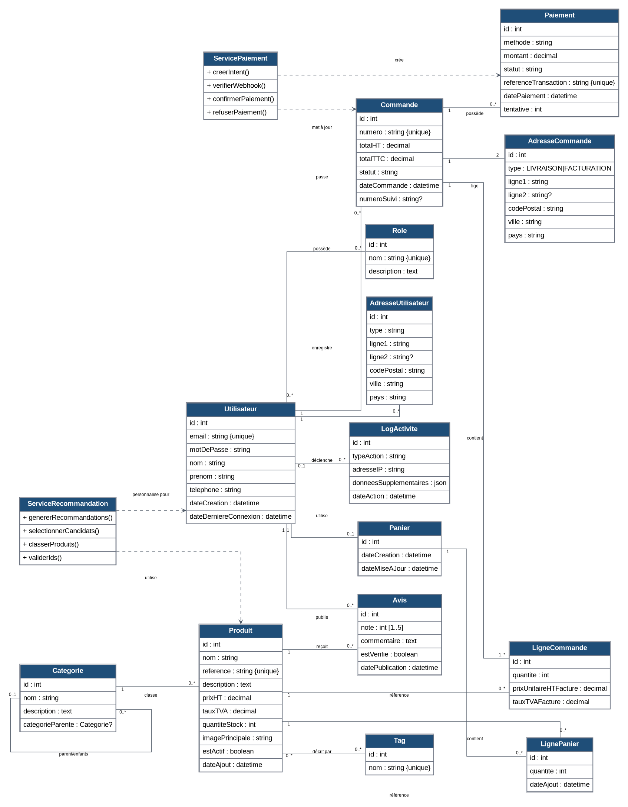
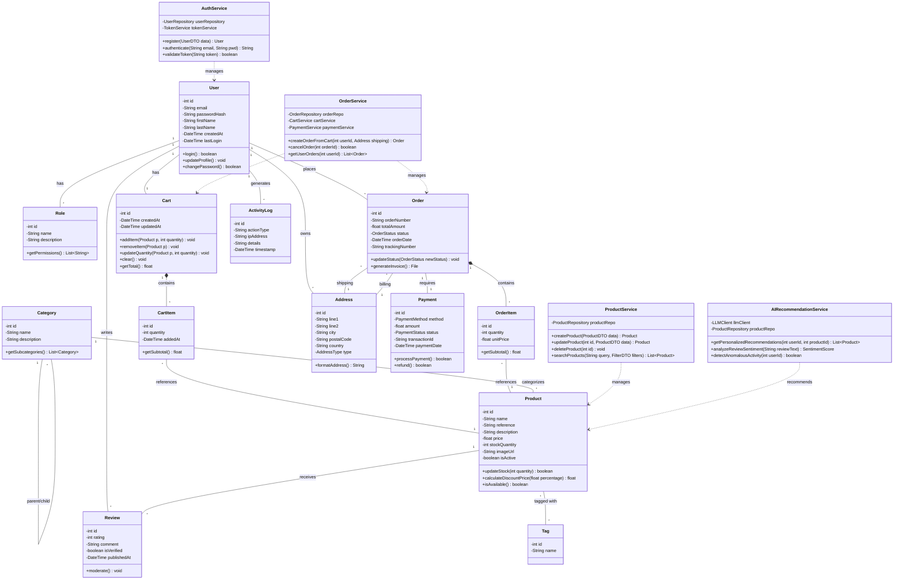

# Diagramme de classes (version corrigée)

> Version finale validée. Le schéma Mermaid ci-dessous est conservé comme source éditable.

# Diagramme de Classes - ShopAI

Ce diagramme présente l'architecture orientée objet du système, incluant les entités principales de la base de données et les services métier.

