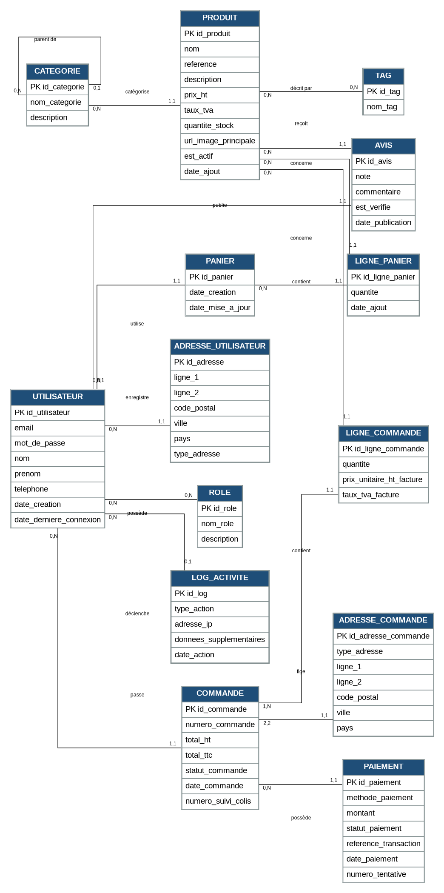
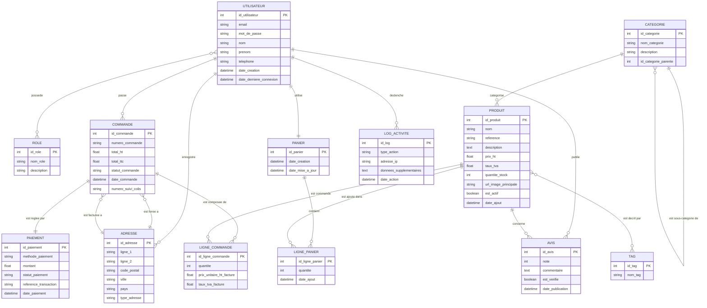

# Modèle Conceptuel de Données (version corrigée)

> Version finale validée. Le schéma Mermaid ci-dessous est conservé comme source éditable.

# Modèle Conceptuel de Données (MCD) - ShopAI

Ce document présente le Modèle Conceptuel de Données pour la plateforme e-commerce ShopAI.

## Diagramme Entité-Association (Mermaid)

