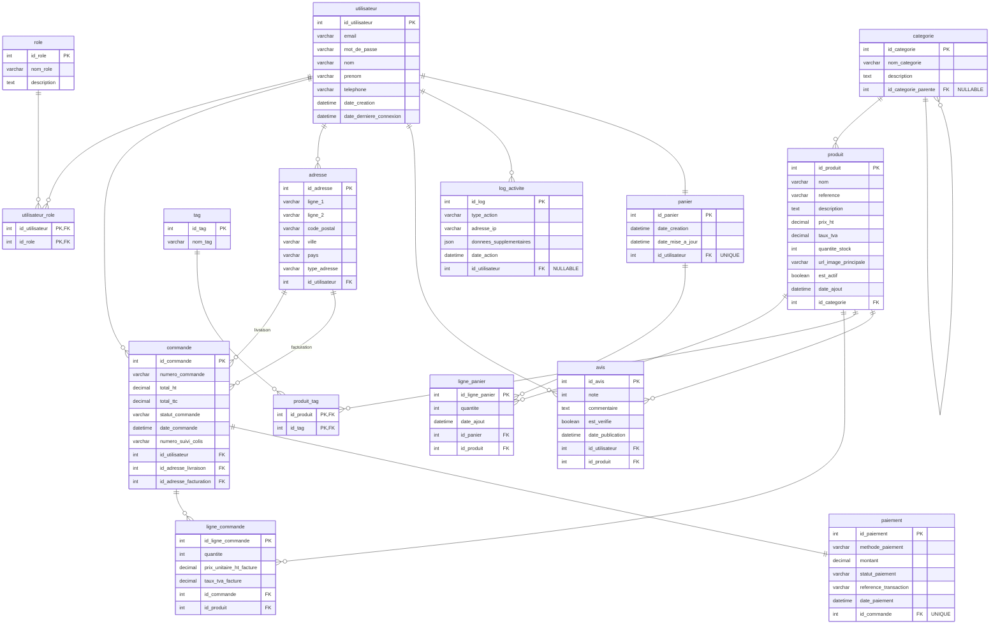

# Modèle Logique de Données (version corrigée)

> Version finale validée. Le schéma Mermaid ci-dessous est conservé comme source éditable.

# Modèle Logique de Données (MLD) - ShopAI

Ce document présente le Modèle Logique de Données, dérivé du MCD, pour l'implémentation physique dans la base de données relationnelle.

## Notation Textuelle

*   **utilisateur** (<ins>id_utilisateur</ins>, email, mot_de_passe, nom, prenom, telephone, date_creation, date_derniere_connexion)
*   **role** (<ins>id_role</ins>, nom_role, description)
*   **utilisateur_role** (<ins>#id_utilisateur</ins>, <ins>#id_role</ins>)
*   **categorie** (<ins>id_categorie</ins>, nom_categorie, description, #id_categorie_parente)
*   **produit** (<ins>id_produit</ins>, nom, reference, description, prix_ht, taux_tva, quantite_stock, url_image_principale, est_actif, date_ajout, #id_categorie)
*   **tag** (<ins>id_tag</ins>, nom_tag)
*   **produit_tag** (<ins>#id_produit</ins>, <ins>#id_tag</ins>)
*   **adresse** (<ins>id_adresse</ins>, ligne_1, ligne_2, code_postal, ville, pays, type_adresse, #id_utilisateur)
*   **panier** (<ins>id_panier</ins>, date_creation, date_mise_a_jour, #id_utilisateur)
*   **ligne_panier** (<ins>id_ligne_panier</ins>, quantite, date_ajout, #id_panier, #id_produit)
*   **commande** (<ins>id_commande</ins>, numero_commande, total_ht, total_ttc, statut_commande, date_commande, numero_suivi_colis, #id_utilisateur, #id_adresse_livraison, #id_adresse_facturation)
*   **ligne_commande** (<ins>id_ligne_commande</ins>, quantite, prix_unitaire_ht_facture, taux_tva_facture, #id_commande, #id_produit)
*   **paiement** (<ins>id_paiement</ins>, methode_paiement, montant, statut_paiement, reference_transaction, date_paiement, #id_commande)
*   **avis** (<ins>id_avis</ins>, note, commentaire, est_verifie, date_publication, #id_utilisateur, #id_produit)
*   **log_activite** (<ins>id_log</ins>, type_action, adresse_ip, donnees_supplementaires, date_action, #id_utilisateur)

## Diagramme avec Clés Étrangères Explicites (Mermaid)

