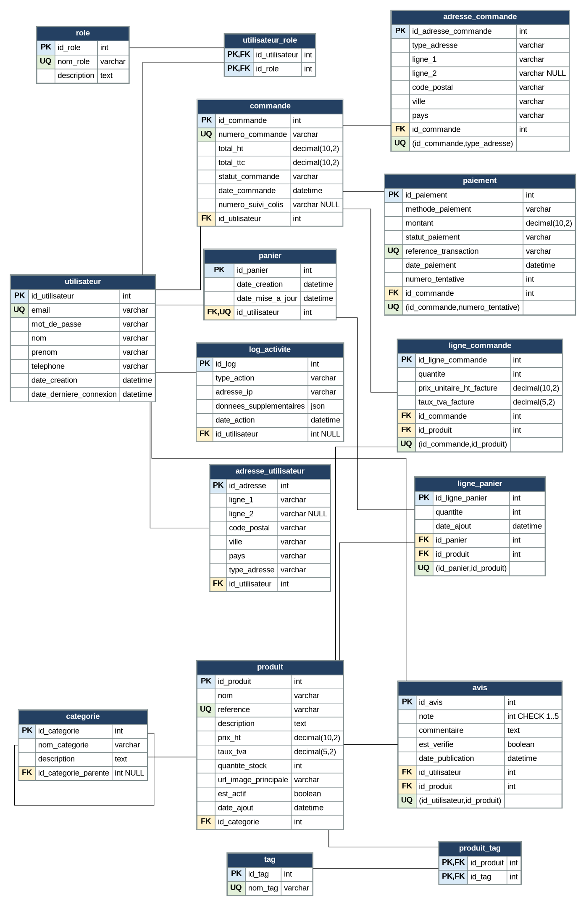

# Modèle Physique de Données (MPD)

Le MPD précise l'implémentation physique : types SQL (varchar, decimal(10,2), datetime, int),
clés primaires (PK), clés étrangères (FK), contraintes d'unicité (UQ) et tables de jointure.
Il correspond au diagramme ci-dessous et au script `database/schema.sql`.

Voir le script SQL exécutable : `database/schema.sql` (création) et `database/seed.sql` (données).
