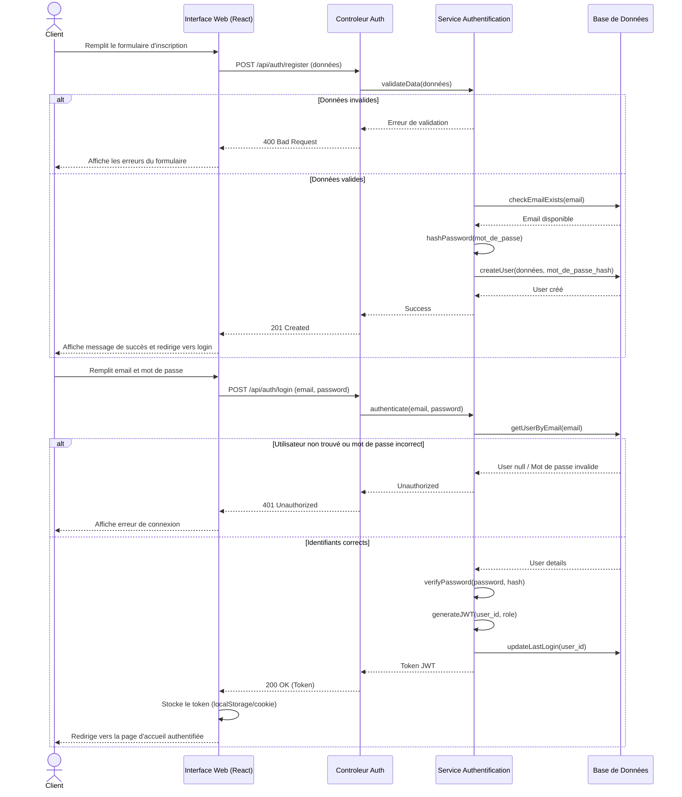
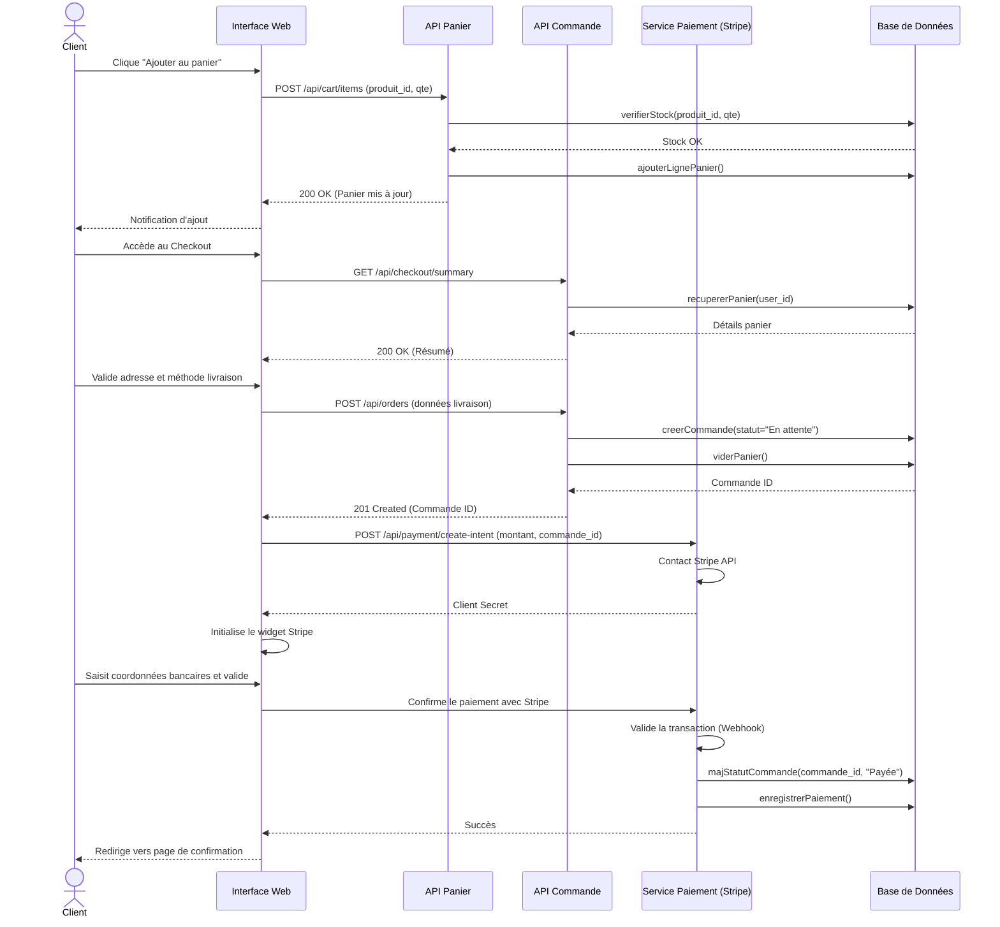
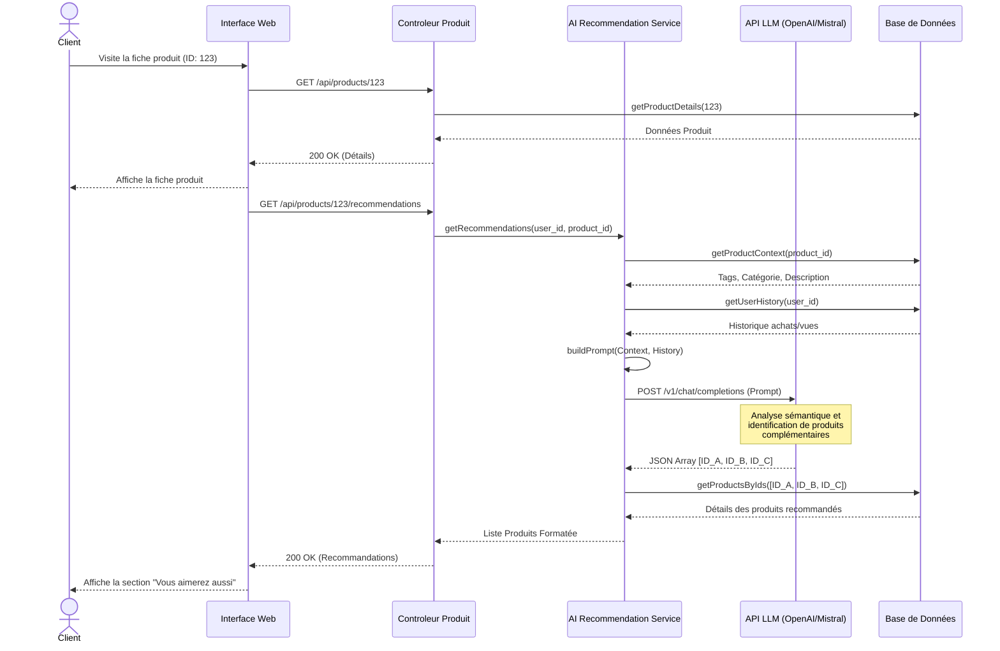

# Diagrammes de Séquence - ShopAI

## Scénario 1 : Inscription & Connexion client

## Scénario 2 : Parcours commande (ajout panier → checkout → paiement)

## Scénario 3 : Recommandation IA (consultation fiche produit → requête LLM → affichage recommandations)

