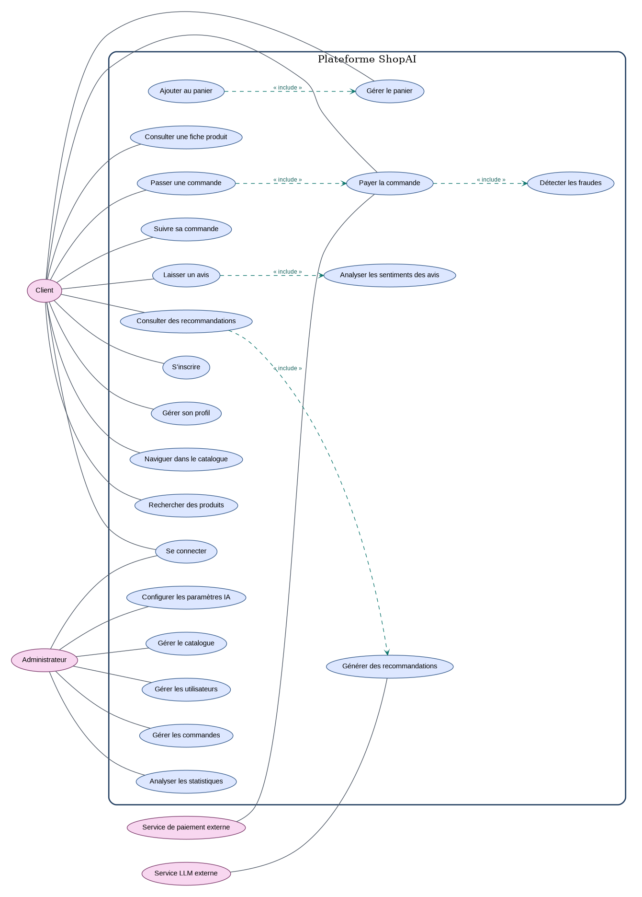

# Diagramme de cas d'utilisation (version corrigée)

> Version finale validée. Le schéma Mermaid ci-dessous est conservé comme source éditable.

# Diagramme des Cas d'Utilisation - ShopAI

Ce diagramme illustre les interactions possibles entre les différents acteurs (Client, Administrateur, Système IA) et la plateforme e-commerce.

## Diagramme Mermaid (Graph)

```mermaid
graph TD
    %% Acteurs
    Client((Client))
    Admin((Administrateur))
    IA((Système IA))

    %% Frontière du système
    subgraph ShopAI [Plateforme ShopAI]
        
        %% Cas d'utilisation Client
        UC_S_inscrire(S'inscrire)
        UC_Se_connecter(Se connecter)
        UC_Gerer_profil(Gérer son profil)
        UC_Naviguer_catalogue(Naviguer dans le catalogue)
        UC_Chercher_produits(Rechercher des produits)
        UC_Consulter_fiche(Consulter fiche produit)
        UC_Ajouter_panier(Ajouter au panier)
        UC_Gerer_panier(Gérer le panier)
        UC_Passer_commande(Passer commande)
        UC_Payer(Payer la commande)
        UC_Suivre_commande(Suivre sa commande)
        UC_Laisser_avis(Laisser un avis)
        UC_Demander_recommandation(Demander des recommandations)

        %% Cas d'utilisation Admin
        UC_Gerer_catalogue(Gérer le catalogue)
        UC_Gerer_utilisateurs(Gérer les utilisateurs)
        UC_Gerer_commandes(Gérer les commandes)
        UC_Analyser_stats(Analyser les statistiques)
        UC_Configurer_IA(Configurer les paramètres IA)

        %% Cas d'utilisation Système IA
        UC_Generer_recos(Générer des recommandations)
        UC_Analyser_avis(Analyser les sentiments des avis)
        UC_Detecter_fraude(Détecter les fraudes)
    end

    %% Relations Client -> Cas d'utilisation
    Client --> UC_S_inscrire
    Client --> UC_Se_connecter
    Client --> UC_Gerer_profil
    Client --> UC_Naviguer_catalogue
    Client --> UC_Chercher_produits
    Client --> UC_Consulter_fiche
    Client --> UC_Gerer_panier
    Client --> UC_Passer_commande
    Client --> UC_Suivre_commande
    Client --> UC_Laisser_avis
    Client --> UC_Demander_recommandation

    %% Relations include/extend Client
    UC_Gerer_profil -.->|<< include >>| UC_Se_connecter
    UC_Passer_commande -.->|<< include >>| UC_Se_connecter
    UC_Suivre_commande -.->|<< include >>| UC_Se_connecter
    UC_Laisser_avis -.->|<< include >>| UC_Se_connecter
    UC_Gerer_panier -.->|<< extend >>| UC_Ajouter_panier
    UC_Passer_commande -.->|<< include >>| UC_Payer

    %% Relations Admin -> Cas d'utilisation
    Admin --> UC_Se_connecter
    Admin --> UC_Gerer_catalogue
    Admin --> UC_Gerer_utilisateurs
    Admin --> UC_Gerer_commandes
    Admin --> UC_Analyser_stats
    Admin --> UC_Configurer_IA

    %% Relations include/extend Admin
    UC_Gerer_catalogue -.->|<< include >>| UC_Se_connecter
    UC_Gerer_utilisateurs -.->|<< include >>| UC_Se_connecter
    UC_Gerer_commandes -.->|<< include >>| UC_Se_connecter
    UC_Analyser_stats -.->|<< include >>| UC_Se_connecter
    UC_Configurer_IA -.->|<< include >>| UC_Se_connecter

    %% Relations Système IA -> Cas d'utilisation
    IA --> UC_Generer_recos
    IA --> UC_Analyser_avis
    IA --> UC_Detecter_fraude

    %% Intéractions croisées
    UC_Demander_recommandation -.->|<< include >>| UC_Generer_recos
    UC_Payer -.->|<< include >>| UC_Detecter_fraude
    UC_Laisser_avis -.->|<< include >>| UC_Analyser_avis
    
    %% Style pour différencier les éléments
    classDef acteur fill:#f9f,stroke:#333,stroke-width:2px;
    class Client,Admin,IA acteur;
    classDef uc fill:#bbf,stroke:#333,stroke-width:1px,rx:10,ry:10;
    class UC_S_inscrire,UC_Se_connecter,UC_Gerer_profil,UC_Naviguer_catalogue,UC_Chercher_produits,UC_Consulter_fiche,UC_Ajouter_panier,UC_Gerer_panier,UC_Passer_commande,UC_Payer,UC_Suivre_commande,UC_Laisser_avis,UC_Demander_recommandation,UC_Gerer_catalogue,UC_Gerer_utilisateurs,UC_Gerer_commandes,UC_Analyser_stats,UC_Configurer_IA,UC_Generer_recos,UC_Analyser_avis,UC_Detecter_fraude uc;
```

