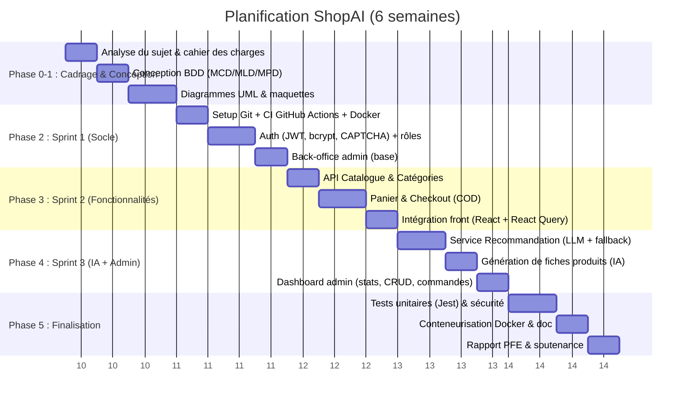

# Plan de Projet — ShopAI

## 1. Diagramme de Gantt (6 semaines)

## 2. Tableau Kanban (état final)

| À Faire | En Cours | Terminé |
| :--- | :--- | :--- |
| Générer l'APK (Capacitor) | Rédaction du rapport PFE | Dépôt GitHub + branches main/develop |
| Maquettes Figma (.fig) | Étoffement de la documentation | Auth JWT + bcrypt + CAPTCHA |
| Avis produits (perspective) | | Verrouillage anti brute-force |
| Paiement en ligne (perspective) | | CRUD produits + génération IA |
| | | Recommandations IA + fallback |
| | | Panier + Checkout COD |
| | | Dashboard admin + journal d'activité |
| | | Tests Jest (14) + CI GitHub Actions |
| | | Conteneurisation Docker (compose) |

## 3. Matrice RACI

| Tâche | Chef de Projet | Dév. Backend | Dév. Frontend | QA |
| :--- | :---: | :---: | :---: | :---: |
| Cadrage & planning | **A/R** | C | C | I |
| Conception BDD & architecture | C | **A/R** | C | I |
| API REST + sécurité | I | **A/R** | C | C |
| UI/UX (web + PWA) | I | C | **A/R** | C |
| Intégration IA (LLM) | A | **R** | C | C |
| Tests, CI/CD & Docker | A | **R** | C | **R** |

*(R = Réalise, A = Approuve, C = Consulté, I = Informé)*

## 4. Gestion des risques

| Risque | Probabilité | Impact | Mitigation |
| :--- | :---: | :---: | :--- |
| Indisponibilité / coût de l'API LLM | Moyenne | Élevé | **Fallback déterministe** intégré (l'app fonctionne sans clé) |
| Dérive du planning (2 personnes) | Moyenne | Moyen | Découpage en sprints + Kanban + priorisation MVP |
| Incohérence schéma BDD ↔ code | Faible | Élevé | Source unique = modèles Sequelize + `npm run seed` |
| Faille de sécurité (auth) | Faible | Élevé | JWT, bcrypt, CAPTCHA, verrouillage, revue OWASP |
| Environnement de démo non reproductible | Moyenne | Moyen | **Docker Compose** (MySQL + back + front en 1 commande) |
| Perte de code | Faible | Élevé | Git + branches + CI à chaque push |
